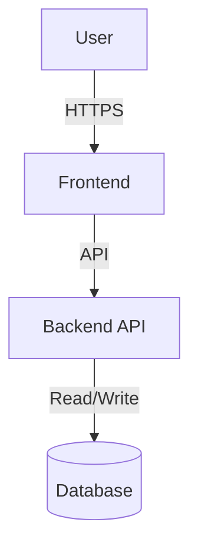

<a id="readme-top"></a>

<!-- BADGES -->
<p align="center">
  
  
  
  
  
  
</p>

<h1 align="center">Project Name</h1>

<p align="center">
  A brief description of what this project does and its main purpose.
</p>

> [!TIP] > **Template Usage**: Click the "Use this template" button above to create a new repository from this template.
> After creating your repository, search for TODO placeholders and replace them with your project details.

---

## Table of Contents

1. [Overview](#overview)
2. [Architecture](#architecture)
3. [Technology Stack](#technology-stack)
4. [Prerequisites](#prerequisites)
5. [Installation](#installation)
6. [Usage](#usage)
7. [Configuration](#configuration)
8. [Deployment](#deployment)
9. [API Reference](#api-reference)
10. [Troubleshooting](#troubleshooting)
11. [Contributing](#contributing)
12. [License](#license)

---

## Overview

Provide a detailed description of the project, its goals, and key features.

### Key Features

- Feature 1: Description
- Feature 2: Description
- Feature 3: Description

---

## Architecture

For detailed architecture documentation, see [docs/ARCHITECTURE.md](docs/ARCHITECTURE.md).



---

## Technology Stack

| Component      | Technology       | Purpose          |
| -------------- | ---------------- | ---------------- |
| Backend        | Python/FastAPI   | API server       |
| Frontend       | React/TypeScript | User interface   |
| Database       | PostgreSQL       | Data persistence |
| Infrastructure | Terraform        | IaC provisioning |
| Container      | Docker           | Containerization |

---

## Prerequisites

### Required Software

- Python 3.11 or higher
- Node.js 20 or higher
- Docker and Docker Compose
- Terraform 1.0 or higher
- AWS CLI v2

### Required API Keys

See [.env.example](.env.example) for required environment variables.

---

## Installation

### Clone Repository

```bash
git clone https://github.com/username/repository.git
cd repository
```

### Backend Setup

```bash
# Create virtual environment
python -m venv .venv
source .venv/bin/activate  # Linux/macOS
# .venv\Scripts\activate   # Windows

# Install dependencies
pip install -r requirements.txt

# Configure environment
cp .env.example .env
# Edit .env with your configuration
```

### Frontend Setup

```bash
cd frontend
npm install
```

---

## Usage

### Development Mode

```bash
# Start backend
python main.py

# Start frontend (in another terminal)
cd frontend
npm run dev
```

### Docker Compose

```bash
docker-compose up
```

---

## Configuration

### Environment Variables

See [.env.example](.env.example) for a complete list of configuration options.

| Variable     | Required | Default | Description                |
| ------------ | -------- | ------- | -------------------------- |
| API_KEY      | Yes      | -       | API key for service        |
| DATABASE_URL | Yes      | -       | Database connection string |
| DEBUG        | No       | false   | Enable debug mode          |
| PORT         | No       | 8000    | Server port                |

---

## Deployment

For detailed deployment instructions, see [docs/DEPLOYMENT.md](docs/DEPLOYMENT.md).

---

## API Reference

For detailed API documentation, see [docs/API.md](docs/API.md).

### Health Check

#### GET /health

Response:

```json
{
  "status": "healthy"
}
```

---

## Troubleshooting

### Common Issues

#### Issue 1: Connection Error

Solution: Verify network connectivity and firewall rules.

#### Issue 2: Authentication Failed

Solution: Check API key configuration in environment variables.

---

## Contributing

Contributions are welcome. Please read [CONTRIBUTING.md](CONTRIBUTING.md) for guidelines.

1. Fork the repository
2. Create a feature branch (`git checkout -b feature/improvement`)
3. Commit changes (`git commit -m 'Add improvement'`)
4. Push to branch (`git push origin feature/improvement`)
5. Open a Pull Request

---

## License

Distributed under the MIT License. See [LICENSE](LICENSE) for details.

---

## Contact

<p align="center">
  <a href="https://linkedin.com/in/username"></a>
  <a href="https://github.com/username"></a>
  <a href="mailto:email@example.com"></a>
</p>

Project Link: https://github.com/username/repository
