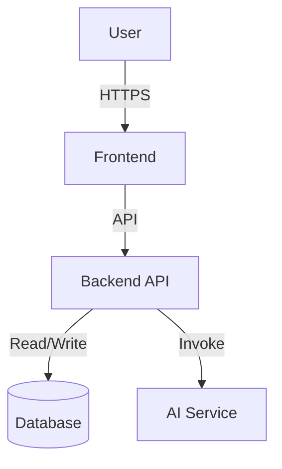

# Architecture

## System Overview

Provide a high-level overview of the system architecture.

## Diagrams

### High-Level Architecture

## Components

### Frontend

Description of the frontend architecture (e.g., React, Next.js).

### Backend

Description of the backend architecture (e.g., FastAPI, Node.js).

### Database

Description of the data model and storage.

## Data Flow

Describe how data flows through the system.
