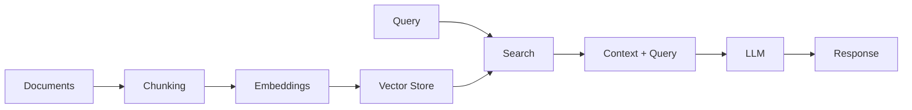

# Amazon Bedrock

## Overview

Fully managed service for accessing foundation models via API.

## Available Foundation Models

| Provider     | Models                         | Strengths                       |
| ------------ | ------------------------------ | ------------------------------- |
| Amazon       | Titan Text, Titan Embeddings   | Cost-effective, AWS-native      |
| Anthropic    | Claude 3 (Opus, Sonnet, Haiku) | Complex reasoning, long context |
| Meta         | Llama 3                        | Open weights, fine-tunable      |
| Mistral      | Mistral, Mixtral               | Efficient, multilingual         |
| Cohere       | Command, Embed                 | RAG, enterprise                 |
| Stability AI | Stable Diffusion               | Image generation                |

## Key Features

### Model Access

```python
import boto3
import json

bedrock_runtime = boto3.client("bedrock-runtime")

response = bedrock_runtime.invoke_model(
    modelId="anthropic.claude-3-sonnet-20240229-v1:0",
    body=json.dumps({
        "anthropic_version": "bedrock-2023-05-31",
        "max_tokens": 1000,
        "messages": [{"role": "user", "content": "Hello!"}]
    })
)
```

### Fine-tuning

Customize models with your data.

| Model      | Fine-tuning Support |
| ---------- | ------------------- |
| Titan Text | Yes                 |
| Llama 3    | Yes                 |
| Cohere     | Yes                 |
| Claude     | No (as of 2024)     |

### Guardrails

Content moderation and safety.

- Topic blocking
- Content filters (hate, violence, etc.)
- PII detection and masking
- Word filters

### Knowledge Bases

RAG (Retrieval Augmented Generation).



### Agents

Autonomous task completion.

- Action groups (Lambda functions)
- Knowledge base integration
- Multi-step reasoning

## Pricing Model

| Pricing Type | Description                  |
| ------------ | ---------------------------- |
| On-demand    | Pay per token                |
| Provisioned  | Reserved capacity            |
| Batch        | Async processing at discount |

## Use Cases

| Use Case         | Recommended Approach           |
| ---------------- | ------------------------------ |
| Text generation  | Claude, Titan Text             |
| Embeddings       | Titan Embeddings, Cohere Embed |
| RAG              | Knowledge Bases                |
| Automation       | Agents                         |
| Image generation | Stable Diffusion, Titan Image  |

## Exam Focus Areas

!!! warning "Key Topics" - When to use Bedrock vs SageMaker - Guardrails for content safety - Knowledge Bases for RAG patterns - Fine-tuning capabilities and limitations
