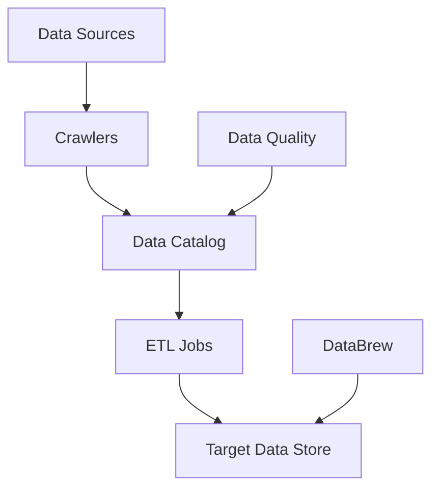

# AWS Glue

## Overview

Serverless data integration service for ETL and data cataloging.

## Components



## AWS Glue Data Catalog

Centralized metadata repository.

| Component   | Description                |
| ----------- | -------------------------- |
| Databases   | Logical grouping of tables |
| Tables      | Metadata definition        |
| Partitions  | Data organization          |
| Connections | Data source credentials    |

## Crawlers

Automatically discover schema.

```python
import boto3

glue = boto3.client("glue")

glue.create_crawler(
    Name="my-crawler",
    Role="AWSGlueServiceRole",
    DatabaseName="my-database",
    Targets={
        "S3Targets": [{"Path": "s3://my-bucket/data/"}]
    },
    Schedule="cron(0 0 * * ? *)"  # Daily
)
```

## ETL Jobs

Spark-based data transformation.

```python
# Glue ETL script
from awsglue.context import GlueContext
from pyspark.context import SparkContext

sc = SparkContext()
glueContext = GlueContext(sc)

# Read from catalog
datasource = glueContext.create_dynamic_frame.from_catalog(
    database="my_db",
    table_name="my_table"
)

# Transform
transformed = datasource.apply_mapping([
    ("old_col", "string", "new_col", "string")
])

# Write
glueContext.write_dynamic_frame.from_options(
    frame=transformed,
    connection_type="s3",
    connection_options={"path": "s3://output/"},
    format="parquet"
)
```

## AWS Glue DataBrew

Visual data preparation.

| Feature  | Description             |
| -------- | ----------------------- |
| Datasets | Data sources            |
| Projects | Interactive preparation |
| Recipes  | Transformation steps    |
| Jobs     | Execute recipes         |

## AWS Glue Data Quality

Automated data quality checks.

```python
# Data quality rules
rules = """
Rules = [
    IsComplete "column_name",
    Uniqueness "id" > 0.99,
    ColumnValues "age" between 0 and 120
]
"""
```

## Job Types

| Type         | Use Case           |
| ------------ | ------------------ |
| Spark        | Large-scale ETL    |
| Python Shell | Simple scripts     |
| Streaming    | Real-time ETL      |
| Ray          | Distributed Python |

## Exam Focus Areas

!!! warning "Key Topics" - Crawlers for schema discovery - Data Catalog for metadata - ETL jobs for transformation - DataBrew for visual preparation - Data Quality for validation
