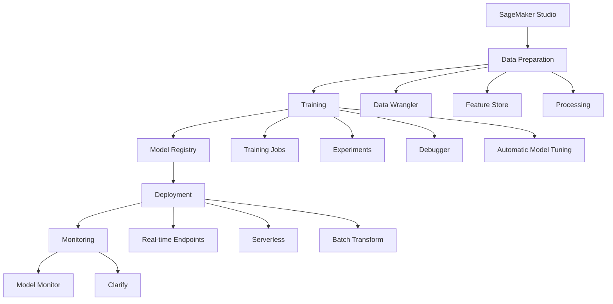

# Amazon SageMaker

## Overview

Fully managed service for building, training, and deploying ML models.

## SageMaker Components

## Key Features

| Feature        | Description                     |
| -------------- | ------------------------------- |
| Studio         | Unified IDE for ML              |
| Data Wrangler  | Visual data preparation         |
| Feature Store  | Centralized feature repository  |
| Training       | Managed training infrastructure |
| Experiments    | Track and compare runs          |
| Debugger       | Debug and profile training      |
| Clarify        | Bias and explainability         |
| Model Registry | Version and manage models       |
| Pipelines      | MLOps workflows                 |
| Model Monitor  | Production monitoring           |

## Instance Types

| Category        | Types             | Use Case           |
| --------------- | ----------------- | ------------------ |
| General         | ml.m5.\*          | Balanced workloads |
| Compute         | ml.c5.\*          | CPU-intensive      |
| GPU             | ml.p3._, ml.p4d._ | Deep learning      |
| GPU (inference) | ml.g4dn.\*        | Inference          |
| Memory          | ml.r5.\*          | Large datasets     |

## Data Channels

| Channel    | Purpose           |
| ---------- | ----------------- |
| train      | Training data     |
| validation | Validation data   |
| test       | Test data         |
| model      | Pre-trained model |

## Training Modes

| Mode     | Description          | Best For          |
| -------- | -------------------- | ----------------- |
| File     | Download to instance | Small/medium data |
| Pipe     | Stream from S3       | Large data        |
| FastFile | POSIX access         | Random access     |

## Exam Focus Areas

!!! warning "Key Topics" - Training job configuration and instance selection - Built-in algorithms and when to use each - Endpoint types and deployment strategies - Model Monitor for production monitoring - Pipelines for MLOps automation
