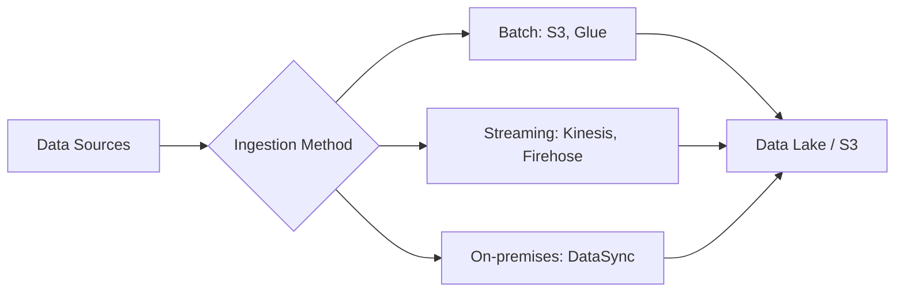

# Domain 1: Data Preparation for Machine Learning

**Weight: 28% of scored content**

This domain covers the foundational skills needed to prepare data for machine learning workloads on AWS.

## Topics Covered

| Topic                                         | Description                          |
| --------------------------------------------- | ------------------------------------ |
| [Data Ingestion](data-ingestion.md)           | S3, Kinesis, Glue, DataSync          |
| [Data Transformation](data-transformation.md) | Glue ETL, DataBrew, EMR, Spark       |
| [Data Validation](data-validation.md)         | Glue Data Quality, data integrity    |
| [Feature Engineering](feature-engineering.md) | SageMaker Feature Store, Processing  |
| [Data Storage](data-storage.md)               | Lake Formation, Athena, data formats |

## Key Concepts

### Data Ingestion Patterns

### Common Data Formats for ML

| Format     | Use Case             | Pros                    |
| ---------- | -------------------- | ----------------------- |
| Parquet    | Columnar analytics   | Compression, fast reads |
| CSV        | Simple tabular data  | Universal compatibility |
| JSON/JSONL | Semi-structured data | Flexibility             |
| RecordIO   | SageMaker training   | Optimized for streaming |
| TFRecord   | TensorFlow training  | TensorFlow native       |

## Study Checklist

- [ ] Understand S3 storage classes and lifecycle policies
- [ ] Know Glue components: Crawlers, Data Catalog, Jobs
- [ ] Understand Kinesis Data Streams vs Data Firehose
- [ ] Know SageMaker Feature Store online vs offline
- [ ] Understand data validation and quality checks
