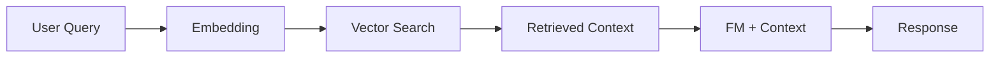

# Amazon Bedrock

## Overview

Fully managed service for foundation models (FMs).

## Key Concepts

| Concept          | Description                  |
| ---------------- | ---------------------------- |
| Foundation Model | Large pre-trained model      |
| Fine-tuning      | Customize FM with your data  |
| Guardrails       | Content filtering and safety |
| Knowledge Bases  | RAG with your data           |
| Agents           | Automated task execution     |

## Available Models

| Provider     | Models                                    |
| ------------ | ----------------------------------------- |
| Amazon       | Titan Text, Titan Embeddings, Titan Image |
| Anthropic    | Claude 3 family                           |
| Meta         | Llama 3 family                            |
| Cohere       | Command, Embed                            |
| Stability AI | Stable Diffusion                          |
| Mistral      | Mistral, Mixtral                          |

## Using Bedrock

### Text Generation

```python
import boto3
import json

bedrock = boto3.client("bedrock-runtime")

response = bedrock.invoke_model(
    modelId="anthropic.claude-3-sonnet-20240229-v1:0",
    contentType="application/json",
    accept="application/json",
    body=json.dumps({
        "anthropic_version": "bedrock-2023-05-31",
        "max_tokens": 1000,
        "messages": [
            {"role": "user", "content": "Explain machine learning in simple terms."}
        ]
    })
)

result = json.loads(response["body"].read())
```

### Embeddings

```python
response = bedrock.invoke_model(
    modelId="amazon.titan-embed-text-v1",
    contentType="application/json",
    accept="application/json",
    body=json.dumps({
        "inputText": "Sample text for embedding"
    })
)
```

## Fine-tuning

Customize models with your data.

```python
bedrock = boto3.client("bedrock")

response = bedrock.create_model_customization_job(
    jobName="my-fine-tuning-job",
    customModelName="my-custom-model",
    roleArn=role_arn,
    baseModelIdentifier="amazon.titan-text-express-v1",
    trainingDataConfig={
        "s3Uri": "s3://bucket/training-data/"
    },
    outputDataConfig={
        "s3Uri": "s3://bucket/output/"
    },
    hyperParameters={
        "epochCount": "3",
        "batchSize": "8",
        "learningRate": "0.00001"
    }
)
```

## Guardrails

Content moderation and filtering.

- Denied topics
- Content filters (hate, violence, etc.)
- Word filters
- PII detection and masking

## Knowledge Bases (RAG)

Augment models with your data.



## Agents

Automate multi-step tasks.

- Define actions via Lambda functions
- Access knowledge bases
- Orchestrate complex workflows

## SageMaker vs Bedrock

| Feature           | SageMaker     | Bedrock               |
| ----------------- | ------------- | --------------------- |
| Custom Training   | Yes           | Limited (fine-tuning) |
| Foundation Models | Via JumpStart | Native                |
| Infrastructure    | Managed       | Serverless            |
| Use Case          | Custom ML     | GenAI applications    |

## Exam Tips

!!! warning "Key Points" - Bedrock is serverless, no infrastructure management - Use fine-tuning for domain-specific customization - Guardrails for content safety - Knowledge Bases for RAG patterns - Agents for complex task automation
