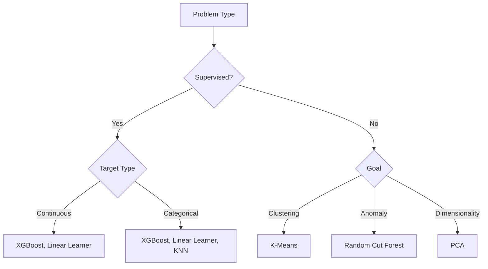

# Built-in Algorithms

## Overview

SageMaker provides optimized built-in algorithms for common ML tasks.

## Supervised Learning

### XGBoost

Gradient boosting for classification and regression.

| Parameter | Description               |
| --------- | ------------------------- |
| num_round | Number of boosting rounds |
| max_depth | Maximum tree depth        |
| eta       | Learning rate             |
| objective | Loss function             |

```python
from sagemaker import image_uris

xgb_image = image_uris.retrieve("xgboost", region, version="1.5-1")

xgb = Estimator(
    image_uri=xgb_image,
    role=role,
    instance_count=1,
    instance_type="ml.m5.xlarge",
    hyperparameters={
        "objective": "binary:logistic",
        "num_round": 100,
        "max_depth": 5
    }
)
```

### Linear Learner

Linear models for classification and regression.

- Supports L1/L2 regularization
- Automatic model tuning
- Built-in normalization

### K-Nearest Neighbors (KNN)

Classification and regression based on similarity.

- Supports different distance metrics
- Index-based for fast inference
- Good for recommendation systems

## Unsupervised Learning

### K-Means

Clustering algorithm.

| Parameter   | Description                       |
| ----------- | --------------------------------- |
| k           | Number of clusters                |
| init_method | Initialization (random, kmeans++) |

### Principal Component Analysis (PCA)

Dimensionality reduction.

- Regular mode: covariance matrix
- Randomized mode: for large datasets

### Random Cut Forest

Anomaly detection.

- Unsupervised anomaly scoring
- Real-time and batch inference

## Computer Vision

### Image Classification

CNN-based image classification.

- Transfer learning with pretrained models
- Multi-GPU training support

### Object Detection

Detect objects and bounding boxes.

- SSD (Single Shot Detector)
- Faster R-CNN

### Semantic Segmentation

Pixel-level classification.

- FCN (Fully Convolutional Network)
- PSP (Pyramid Scene Parsing)

## NLP

### BlazingText

Word embeddings and text classification.

| Mode                | Use Case                  |
| ------------------- | ------------------------- |
| Word2Vec            | Word embeddings           |
| Text Classification | Supervised classification |

### Sequence-to-Sequence

Encoder-decoder for translation, summarization.

## Algorithm Selection Guide



## Exam Tips

!!! warning "Algorithm Selection" - XGBoost: Most versatile, start here for tabular data - Linear Learner: Sparse data, need interpretability - Random Cut Forest: Streaming anomaly detection - BlazingText: Fast text classification
