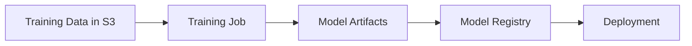

# Domain 2: ML Model Development

**Weight: 26% of scored content**

This domain covers model selection, training, hyperparameter tuning, evaluation, and versioning.

## Topics Covered

| Topic                                             | Description                                         |
| ------------------------------------------------- | --------------------------------------------------- |
| [SageMaker Training](sagemaker-training.md)       | Training jobs, instance types, distributed training |
| [Built-in Algorithms](built-in-algorithms.md)     | XGBoost, Linear Learner, etc.                       |
| [Hyperparameter Tuning](hyperparameter-tuning.md) | Automatic model tuning                              |
| [Model Evaluation](model-evaluation.md)           | Metrics, SageMaker Clarify                          |
| [Model Versioning](model-versioning.md)           | Model Registry                                      |
| [Amazon Bedrock](amazon-bedrock.md)               | Foundation models                                   |

## Key Concepts

### SageMaker Training Workflow

### Choosing the Right Algorithm

| Problem Type      | Built-in Algorithms                    |
| ----------------- | -------------------------------------- |
| Classification    | XGBoost, Linear Learner, KNN           |
| Regression        | XGBoost, Linear Learner                |
| Clustering        | K-Means                                |
| Anomaly Detection | Random Cut Forest                      |
| NLP               | BlazingText, Seq2Seq                   |
| Computer Vision   | Image Classification, Object Detection |
| Recommendations   | Factorization Machines                 |

## Study Checklist

- [ ] Understand SageMaker training job configuration
- [ ] Know built-in algorithms and their use cases
- [ ] Understand hyperparameter tuning strategies
- [ ] Know evaluation metrics for different problem types
- [ ] Understand Model Registry for versioning
- [ ] Know when to use Bedrock vs custom training
