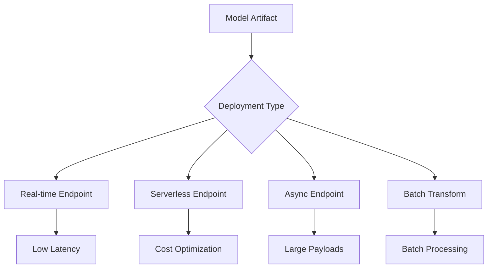

# Domain 3: Deployment and Orchestration of ML Workflows

**Weight: 22% of scored content**

This domain covers deploying models and automating ML pipelines.

## Topics Covered

| Topic                                           | Description                  |
| ----------------------------------------------- | ---------------------------- |
| [SageMaker Endpoints](sagemaker-endpoints.md)   | Real-time, Serverless, Async |
| [Batch Transform](batch-transform.md)           | Batch inference              |
| [SageMaker Pipelines](sagemaker-pipelines.md)   | MLOps workflows              |
| [Step Functions](step-functions.md)             | Workflow orchestration       |
| [Container Deployment](container-deployment.md) | ECR, ECS, EKS                |
| [Auto Scaling](auto-scaling.md)                 | Scaling endpoints            |

## Key Concepts

### Deployment Options

### Choosing Endpoint Type

| Type       | Latency              | Cost            | Use Case           |
| ---------- | -------------------- | --------------- | ------------------ |
| Real-time  | Milliseconds         | Pay per hour    | Interactive apps   |
| Serverless | Seconds (cold start) | Pay per request | Variable traffic   |
| Async      | Minutes              | Pay per hour    | Large payloads     |
| Batch      | Hours                | Pay per job     | Offline processing |

## Study Checklist

- [ ] Understand endpoint types and when to use each
- [ ] Know SageMaker Pipelines components
- [ ] Understand Step Functions for orchestration
- [ ] Know container requirements for deployment
- [ ] Understand auto-scaling configuration
