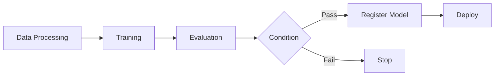

# SageMaker Pipelines

## Overview

Native MLOps service for building, automating, and managing ML workflows.

## Pipeline Components



## Step Types

| Step            | Description                               |
| --------------- | ----------------------------------------- |
| ProcessingStep  | Data processing with SageMaker Processing |
| TrainingStep    | Model training                            |
| TuningStep      | Hyperparameter tuning                     |
| TransformStep   | Batch inference                           |
| CreateModelStep | Create model from artifacts               |
| RegisterModel   | Register to Model Registry                |
| ConditionStep   | Conditional branching                     |
| FailStep        | Fail the pipeline                         |
| LambdaStep      | Run Lambda function                       |
| CallbackStep    | Wait for external process                 |

## Creating a Pipeline

```python
from sagemaker.workflow.pipeline import Pipeline
from sagemaker.workflow.steps import ProcessingStep, TrainingStep
from sagemaker.workflow.parameters import ParameterString

# Define parameters
input_data = ParameterString(name="InputData", default_value="s3://bucket/data/")

# Processing step
processing_step = ProcessingStep(
    name="PreprocessData",
    processor=processor,
    inputs=[ProcessingInput(source=input_data, destination="/opt/ml/processing/input")],
    outputs=[ProcessingOutput(source="/opt/ml/processing/output", destination="s3://bucket/processed/")]
)

# Training step
training_step = TrainingStep(
    name="TrainModel",
    estimator=estimator,
    inputs={"train": processing_step.properties.ProcessingOutputConfig.Outputs["train"].S3Output.S3Uri}
)

# Create pipeline
pipeline = Pipeline(
    name="my-ml-pipeline",
    parameters=[input_data],
    steps=[processing_step, training_step]
)

pipeline.upsert(role_arn=role)
pipeline.start()
```

## Conditional Steps

```python
from sagemaker.workflow.conditions import ConditionGreaterThanOrEqualTo
from sagemaker.workflow.condition_step import ConditionStep

condition = ConditionGreaterThanOrEqualTo(
    left=evaluation_step.properties.ProcessingOutputConfig.Outputs["metrics"].S3Output.S3Uri,
    right=0.8
)

condition_step = ConditionStep(
    name="CheckAccuracy",
    conditions=[condition],
    if_steps=[register_step, deploy_step],
    else_steps=[fail_step]
)
```

## Pipeline Parameters

```python
from sagemaker.workflow.parameters import ParameterInteger, ParameterFloat

instance_count = ParameterInteger(name="InstanceCount", default_value=1)
learning_rate = ParameterFloat(name="LearningRate", default_value=0.01)

# Use in estimator
estimator = Estimator(
    instance_count=instance_count,
    hyperparameters={"learning_rate": learning_rate}
)
```

## Best Practices

!!! tip "Pipeline Design" 1. Use parameters for flexibility 2. Add condition steps for quality gates 3. Register models only after validation 4. Use caching for faster re-runs 5. Version your pipeline definitions

## Exam Tips

!!! warning "Key Points" - Pipelines automate end-to-end ML workflows - ConditionStep for quality gates before deployment - Parameters make pipelines reusable - Integration with Model Registry for governance
