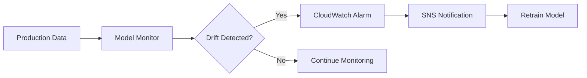

# Domain 4: ML Solution Monitoring, Maintenance, and Security

**Weight: 24% of scored content**

This domain covers monitoring, cost optimization, and security for ML solutions.

## Topics Covered

| Topic                                       | Description               |
| ------------------------------------------- | ------------------------- |
| [Model Monitoring](model-monitoring.md)     | Model Monitor, data drift |
| [CloudWatch Logging](cloudwatch-logging.md) | CloudWatch, CloudTrail    |
| [Cost Optimization](cost-optimization.md)   | Cost Explorer, Budgets    |
| [IAM Security](iam-security.md)             | IAM, KMS, Secrets Manager |
| [Compliance](compliance.md)                 | Macie, Config             |

## Key Concepts

### Monitoring Workflow

### Security Layers

| Layer      | Services                 |
| ---------- | ------------------------ |
| Identity   | IAM, IAM Identity Center |
| Encryption | KMS, S3 encryption       |
| Network    | VPC, Security Groups     |
| Data       | Macie, data masking      |
| Secrets    | Secrets Manager          |

## Study Checklist

- [ ] Understand SageMaker Model Monitor types
- [ ] Know CloudWatch metrics and alarms
- [ ] Understand cost optimization strategies
- [ ] Know IAM best practices for ML
- [ ] Understand encryption options (KMS)
- [ ] Know VPC configuration for SageMaker
